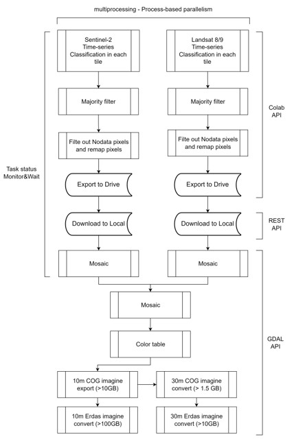

# In-Season Crop Mapping Automation

This Python script automates the generation of **In-season crop classification maps** for the Conterminous United States (CONUS) using **Landsat 8/9** and **Sentinel-2** satellite imagery with Google Earth Engine.

---

## Features

- Authenticates and initializes Google Earth Engine (GEE).
- Defines temporal parameters dynamically based on the current date, focusing on the previous month.
- Generates trusted training pixel labels from multi-year historical Crop Data Layer (CDL).
- Runs parallel classification pipelines for Landsat 8/9 and Sentinel-2 using multiprocessing (classification on the cloud, download to local, mosaic to two images).
- Mosaics Landsat and Sentinel-2 classification results into a 10-meter resolution mosaic.
- Clips the mosaic using CONUS boundary shapefile, exporting Cloud-Optimized GeoTIFF (COG).
- Converts clipped COG raster to Erdas Imagine IMG format.
- Resamples the 10m COG to 30m COG and converts it to Erdas IMG format.
- Cleans up intermediate mosaic files and local classification tiles.
- Deletes processed classification files from Google Drive after a delay.
- Logs script start time, end time, and total elapsed processing time.

---

## Requirements

- Python packages:
  - `earthengine-api (ee)`
  - `osgeo.gdal`
  - `google-auth`
  - `google-api-python-client`
  - `numpy`
  - `multiprocessing`
- Custom modules included in the repo:
  - `TrustedPixel`
  - `ErdasConvert`
  - `MosaicL89S2`
  - `ClipRasterByShp`
  - `ResampleTool`
  - `DeleteDriveFiles`
  - `AutomatedL89Mapping` (provides `L89MosaicClassification`)
  - `AutomatedS2Mapping` (provides `S2MosaicClassification`)

---

## Usage

1. **Authenticate and initialize Google Earth Engine**  
    The script triggers the GEE authentication flow at runtime.

2. **Configure input parameters** (currently hardcoded):  
    - Input shapefile for CONUS boundary (`ShapeFile/CONUS_boundary_5070.shp`)  
    - Local output folders (`Results/`, `Results/AutoInseasonL89S2_Mosaic/`, etc.)  
    - Google Drive export folders for intermediate classified tiles

3. **Run the script:** 
    crontab -e
    00 04 01 7,8,9 * /home/hli47/InseasonMapping/Code/run_InseasonMapping.sh

4. **Outputs generated:** 
    Mosaic, clipped, and resampled crop classification maps in COG formats saved under Results folder.
    Convert COG to and Erdas IMG saved under Results folder
    Intermediate temporary files cleaned automatically.
    Exported files deleted from Google Drive after processing.

## Important Notes
    The script uses multiprocessing to parallelize Landsat 8/9 and Sentinel-2 classification for faster execution.
    The CONUS boundary excludes Alaska, Hawaii, and U.S. territories.
    Cloud cover thresholds are set to 10% for Sentinel-2 and 15% for Landsat 8/9 by default.
    A 1 second waiting time must be set between each download request to Google Cloud.
    There is a built-in wait period (30 seconds) before deleting Google Drive export files to ensure upload completion.
    Exception handling is implemented to continue processing even if some steps fail.

## Directory Structure Example
    InseasonMapping/
    ├── Code/
    │   ├── AutoInseasonMapping.py
    │   ├── AutomatedL89Mapping.py
    │   ├── AutomatedS2Mapping.py
    │   ├── ClipRasterByShp.py
    │   ├── ColorTable.py
    │   ├── ColorTool.py
    │   ├── DeleteDriveFiles.py
    │   ├── DownloadTool.py
    │   ├── ErdasConvert.py
    │   ├── MosaicL89S2.py
    │   ├── MosaicL89S2.py
    │   ├── MosaicMultiImg.py
    │   ├── RemapTable.py
    │   ├── RemapTool.py
    │   ├── ResampleTool.py
    │   └── TrustedPixel.py
    ├── ShapeFile/
    │   └── CONUS_boundary_5070.shp
    └── Results/
        ├── AutoInseasonL89S2_Mosaic/
        └── AutoInseasonL89S2_Result/

